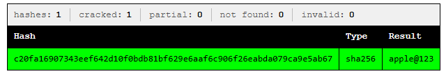
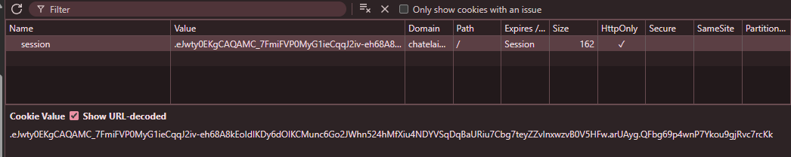
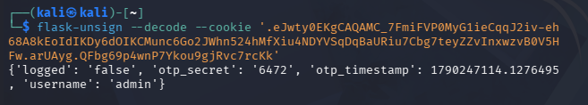
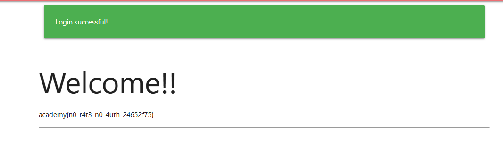

# No FA — Web Exploitation (Medium)

> **Category:** Web Exploitation
> **Difficulty:** Medium
> **Flag:** `academy{n0_r4t3_n0_4uth_24652f75}`

## Challenge Overview

The target is a Flask application with a login flow gated behind two-factor
authentication (2FA). The goal is to authenticate as `admin` and reach a
protected page that only reveals a flag to that user.

## TL;DR

Flask's session cookie is **signed, not encrypted** — so its contents are
plainly readable by anyone who has the cookie, no secret key required. In
this challenge, the server stashes the 4-digit OTP directly inside the
session it hands back to the client mid-login. Decoding that cookie exposes
the OTP in plaintext, letting us skip 2FA entirely and log straight in as
`admin`.

## Step-by-Step

### 1. Review the application source

Reading through the Flask app's login logic shows the general auth flow:

1. `POST /login` checks the submitted username/password against the
   database (passwords stored as unsalted SHA-256 hashes).
2. If the account has 2FA enabled, the server generates a 4-digit OTP,
   and stores it — along with the username and a timestamp — **in the
   session**, before redirecting to `/two_fa`.
3. `POST /two_fa` compares the submitted OTP against `session['otp_secret']`
   and, if it matches (and hasn't expired), flips `session['logged']` to
   `'true'`.
4. The home page reveals the flag only when `session['username'] == 'admin'`.

The key weakness: the OTP is generated server-side and placed into the
**client-held** session cookie, with only a code comment (`# send OTP to
mail`) suggesting it was *meant* to also be emailed. Since Flask sessions
are just signed, base64-encoded JSON — not encrypted — anything stored in
the session is visible to whoever holds the cookie.

### 2. Check the leaked data

Some leaked/exposed data included a set of admin credentials as a
username/hash pair:

```
adminiamadmin@nfs.com : c20fa16907343eef642d10f0bdb81bf629e6aaf6c906f26eabda079ca9e5ab67e
```

### 3. Crack the password hash

The hash is SHA-256, so it can be run through
[CrackStation](https://crackstation.net/), which resolves it against known
wordlists/rainbow tables:



```
c20fa16907343eef642d10f0bdb81bf629e6aaf6c906f26eabda079ca9e5ab67e → apple@123
```

Logging in with `admin` / `apple@123` succeeds and — since this account has
2FA enabled — the app redirects to `/two_fa` and issues a session cookie.

### 4. Grab the session cookie

Using the browser DevTools **Application → Cookies** panel, the `session`
cookie value can be copied directly from the response:



```
eJwty0EKgCAQAMC_7FmiFVP0MyG1ieCqqJ2iv-eh68A8kEoIdIKDy6dOIKCMunc6Go
2JWhn524hMfXiu4NDYVSqDqBaURiu7Cbg7teyZZvInxwzvB0V5HFw.arUAyg.QFbg69
p4wnP7Ykou9gjRvc7rcKk
```

### 5. Decode the cookie

Flask session cookies have three dot-separated parts: a base64-encoded JSON
**payload**, a **timestamp**, and an HMAC **signature** computed with the
server's `SECRET_KEY`. Only the signature needs the secret — the payload
itself is just base64, so it can be read by anyone without cracking or
brute-forcing anything.

[`flask-unsign`](https://pypi.org/project/flask-unsign/) makes this trivial:

```bash
flask-unsign --decode --cookie '<cookie value>'
```

- `--decode` — reverses the base64 encoding on the payload segment only; it
  does **not** touch or verify the signature, so no `SECRET_KEY` is needed.
- `--cookie` — the full three-part cookie string to decode.

Running it against the captured cookie:



```json
{
  "logged": "false",
  "otp_secret": "6472",
  "otp_timestamp": 1790247114.1276495,
  "username": "admin"
}
```

The OTP (`6472`) is sitting right there in plaintext — the client never
needed to receive it over email or SMS, because the server had already
handed it over inside the session cookie.

### 6. Submit the OTP

Entering `6472` on the `/two_fa` page (well within the challenge's OTP
expiry window) completes the login as `admin`, and the home page reveals
the flag:



```
academy{n0_r4t3_n0_4uth_24652f75}
```

## Root Cause

Flask (and `itsdangerous`, which powers its session signing) guarantees
**integrity**, not **confidentiality**. Anything placed in `session[...]`
is visible to the client that holds the cookie. Storing a secret
(an OTP, a password reset token, etc.) in the session — instead of only a
reference to it, verified server-side against a value the client never
sees — defeats the entire purpose of the second factor.

## Remediation

- Never store OTP values, tokens, or other secrets directly in the client
  session. Keep them server-side (database or server-side cache such as
  Redis) keyed by a session ID, and only store the session ID client-side.
- If a value must live in the session, treat the session cookie as public
  data — anything sensitive placed in it should be assumed leaked.
- Rate-limit and lock out repeated OTP attempts at `/two_fa` to reduce the
  practical impact of a short, low-entropy (4-digit) OTP space, even if
  this particular leak is fixed.
- Actually deliver the OTP out-of-band (email/SMS) rather than only
  storing it server-generated but client-visible.

## Tools Used

- [CrackStation](https://crackstation.net/) — SHA-256 hash lookup
- Browser DevTools — inspecting the `session` cookie
- [`flask-unsign`](https://pypi.org/project/flask-unsign/) — decoding the
  Flask session cookie payload
