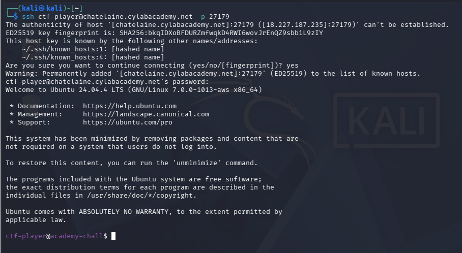
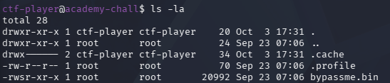
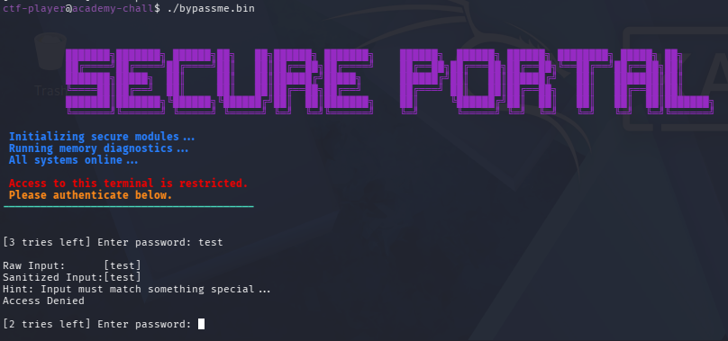
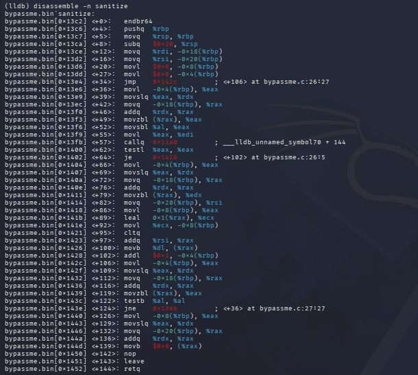
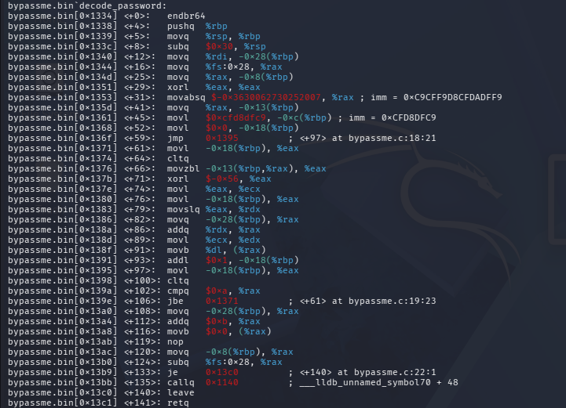
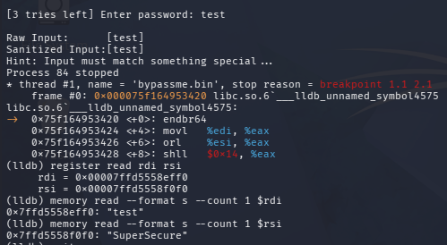
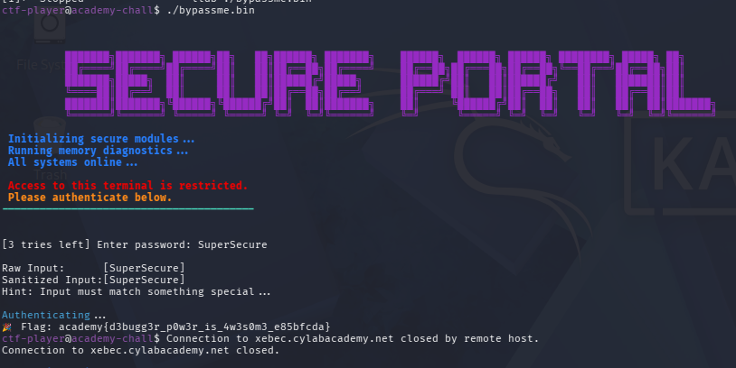

# Bypass Me - Medium

**Category - Reverse Engineering**

## 1. Connect with the challenge

```bash
ssh ctf-player@chatelaine.cylabacademy.net -p 27179
```



## 2. Initial Inspection

First, I listed the files in the challenge directory:



```
ctf-player@academy-chall$ ls -la
total 28
drwxr-xr-x 1 ctf-player ctf-player    20 Oct  3 17:31 .
drwxr-xr-x 1 root       root          24 Sep 23 07:06 ..
drwx------ 2 ctf-player ctf-player    34 Oct  3 17:31 .cache
-rw-r--r-- 1 root       root          70 Sep 23 07:06 .profile
-rwsr-xr-x 1 root       root       20992 Sep 23 07:06 bypassme.bin
```

The `s` in the permissions indicates that the binary has **SUID**
permission and runs with the owner's privileges. Since the owner is
`root`, successfully bypassing the authentication could potentially
allow the program to access a protected file.

Then ran the program:



```
ctf-player@academy-chall$ ./bypassme.bin

SECURE PORTAL

Initializing secure modules ...
Running memory diagnostics ...
All systems online ...

Access to this terminal is restricted.
Please authenticate below.

[3 tries left] Enter password: test

Raw Input:      [test]
Sanitized Input:[test]
Hint: Input must match something special ...
Access Denied

[2 tries left] Enter password:
```

This showed that the program performs some kind of **input
sanitization** before checking the password.

## 3. Looking at the strings

I used:

```bash
strings bypassme.bin
```

This extracts readable text stored inside the binary.

Some interesting strings were:

```
strcmp
sanitize
decode_password
auth_sequence
main
```

This gave me a rough idea of the program structure:

```
main
├── decode_password
├── sanitize
├── compare password
└── read flag if successful
```

The strings `../../root/flag.txt` also suggested that the program would
read the flag after successful authentication.

## 4. Understand sanitize()

I disassembled the `sanitize` function:

```
(lldb) disassemble -n sanitize
```



```
(lldb) disassemble -n sanitize
bypassme.bin`sanitize:
bypassme.bin[0x13c2] <+0>:   endbr64
bypassme.bin[0x13c6] <+4>:   pushq  %rbp
bypassme.bin[0x13c7] <+5>:   movq   %rsp, %rbp
bypassme.bin[0x13ca] <+8>:   subq   $0x20, %rsp
bypassme.bin[0x13ce] <+12>:  movq   %rdi, -0x18(%rbp)
bypassme.bin[0x13d2] <+16>:  movq   %rsi, -0x20(%rbp)
bypassme.bin[0x13d6] <+20>:  movl   $0x0, -0x8(%rbp)
bypassme.bin[0x13dd] <+27>:  movl   $0x0, -0x4(%rbp)
bypassme.bin[0x13e4] <+34>:  jmp    0x142c                 ; <+106> at bypassme.c:26:27
bypassme.bin[0x13e6] <+36>:  movl   -0x4(%rbp), %eax
bypassme.bin[0x13e9] <+39>:  movslq %eax, %rdx
bypassme.bin[0x13ec] <+42>:  movq   -0x18(%rbp), %rax
bypassme.bin[0x13f0] <+46>:  addq   %rdx, %rax
bypassme.bin[0x13f3] <+49>:  movzbl (%rax), %eax
bypassme.bin[0x13f6] <+52>:  movsbl %al, %eax
bypassme.bin[0x13f9] <+55>:  movl   %eax, %edi
bypassme.bin[0x13fb] <+57>:  callq  0x11a0                 ; ___lldb_unnamed_symbol70 + 144
bypassme.bin[0x1400] <+62>:  testl  %eax, %eax
bypassme.bin[0x1402] <+64>:  je     0x1428                 ; <+102> at bypassme.c:26:5
bypassme.bin[0x1404] <+66>:  movl   -0x4(%rbp), %eax
bypassme.bin[0x1407] <+69>:  movslq %eax, %rdx
bypassme.bin[0x140a] <+72>:  movq   -0x18(%rbp), %rax
bypassme.bin[0x1411] <+79>:  addq   %rdx, %rax
bypassme.bin[0x1414] <+82>:  movzbl (%rax), %eax
bypassme.bin[0x1418] <+86>:  movl   -0x20(%rbp), %ecx
bypassme.bin[0x141b] <+89>:  leal   0x1(%rcx), %edx
bypassme.bin[0x141e] <+92>:  movl   %ecx, -0x8(%rbp)
bypassme.bin[0x1421] <+95>:  cltq
bypassme.bin[0x1423] <+97>:  addq   %rsi, %rax
bypassme.bin[0x1426] <+100>: movb   %dl, (%rax)
bypassme.bin[0x1428] <+102>: movl   -0x4(%rbp), %eax
bypassme.bin[0x142c] <+106>: addl   $0x1, -0x4(%rbp), %eax
bypassme.bin[0x142f] <+109>: movslq %eax, %rdx
bypassme.bin[0x1432] <+112>: addq   %rdx, %rax
bypassme.bin[0x1436] <+116>: movzbl (%rax), %eax
bypassme.bin[0x1439] <+119>: movzbl (%rax), %eax
bypassme.bin[0x143c] <+122>: testb  %al, %al
bypassme.bin[0x143e] <+124>: jne    0x13e6                 ; <+36> at bypassme.c:27:27
bypassme.bin[0x1440] <+126>: movl   -0x8(%rbp), %eax
bypassme.bin[0x1443] <+129>: movslq %eax, %rdx
bypassme.bin[0x1446] <+132>: movq   -0x20(%rbp), %rax
bypassme.bin[0x144a] <+136>: addq   %rdx, %rax
bypassme.bin[0x144e] <+139>: movb   $0x0, (%rax)
bypassme.bin[0x1450] <+142>: nop
bypassme.bin[0x1451] <+143>: leave
bypassme.bin[0x1452] <+144>: retq
```

The important part of the assembly showed a call to:

```
callq ... ; isalpha
```

`isalpha()` checks whether a character is an alphabetic character.

The logic was essentially:

```c
if (isalpha(input[i])) {
    output[j++] = input[i];
}
```

So the function removes characters that aren't letters.

In simple terms:

```
Input:
a630e1f8

Remove numbers:
aef

Output:
aef
```

Therefore, entering numbers or symbols would not necessarily reach the
password comparison in the same form.

The overall function can be represented as:

```c
void sanitize(input, output)
{
    for each character in input:
        if character is a letter:
            copy it to output
    add '\0' at the end
}
```

## 5. Finding the hidden password

Next, I examined `decode_password` using:

```
(lldb) disassemble -n decode_password
```



```
bypassme.bin`decode_password:
bypassme.bin[0x1334] <+0>:   endbr64
bypassme.bin[0x1338] <+4>:   pushq  %rbp
bypassme.bin[0x1339] <+5>:   movq   %rsp, %rbp
bypassme.bin[0x133c] <+8>:   subq   $0x30, %rsp
bypassme.bin[0x1340] <+12>:  movq   %rdi, -0x28(%rbp)
bypassme.bin[0x1344] <+16>:  movq   %fs:0x28, %rax
bypassme.bin[0x134d] <+25>:  movq   %rax, -0x8(%rbp)
bypassme.bin[0x1351] <+29>:  xorl   %eax, %eax
bypassme.bin[0x1353] <+31>:  movabsq $-0x3630062730252007, %rax  ; imm = 0xC9CFF9D8CFDADFF9
bypassme.bin[0x135d] <+41>:  movq   %rax, -0x13(%rbp)
bypassme.bin[0x1361] <+45>:  movl   $0xcfd8dfc9, -0xc(%rbp)      ; imm = 0xCFD8DFC9
bypassme.bin[0x1368] <+52>:  movl   $0x0, -0x18(%rbp)
bypassme.bin[0x136f] <+59>:  jmp    0x1395                       ; <+97> at bypassme.c:18:21
bypassme.bin[0x1371] <+61>:  movl   -0x18(%rbp), %eax
bypassme.bin[0x1374] <+64>:  cltq
bypassme.bin[0x1376] <+66>:  movzbl -0x13(%rbp,%rax), %eax
bypassme.bin[0x137b] <+71>:  xorl   $-0x56, %eax
bypassme.bin[0x137e] <+74>:  movl   %eax, %ecx
bypassme.bin[0x1380] <+76>:  movl   -0x18(%rbp), %eax
bypassme.bin[0x1383] <+79>:  movslq %eax, %rdx
bypassme.bin[0x1386] <+82>:  movq   -0x28(%rbp), %rax
bypassme.bin[0x138a] <+86>:  addq   %rdx, %rax
bypassme.bin[0x138d] <+89>:  movb   %dl, (%rax)
bypassme.bin[0x138f] <+91>:  addl   $0x1, -0x18(%rbp)
bypassme.bin[0x1395] <+97>:  movl   -0x18(%rbp), %eax
bypassme.bin[0x1398] <+100>: cltq
bypassme.bin[0x139a] <+102>: cmpq   $0xa, %rax                   ; <+61> at bypassme.c:19:23
bypassme.bin[0x139e] <+106>: jbe    0x1371
bypassme.bin[0x13a0] <+108>: movq   -0x28(%rbp), %rax
bypassme.bin[0x13a4] <+112>: addq   $0xb, %rax
bypassme.bin[0x13a8] <+116>: movb   $0x0, (%rax)
bypassme.bin[0x13ab] <+119>: nop
bypassme.bin[0x13ac] <+120>: movq   -0x8(%rbp), %rax
bypassme.bin[0x13b0] <+124>: subq   %fs:0x28, %rax
bypassme.bin[0x13b9] <+133>: je     0x13c0                       ; <+140> at bypassme.c:22:1
bypassme.bin[0x13bb] <+135>: callq  0x1140                       ; ___lldb_unnamed_symbol70 + 48
bypassme.bin[0x13c0] <+140>: leave
bypassme.bin[0x13c1] <+141>: retq
```

The function contained hard-coded hexadecimal values such as:

```
movabsq $-0x3630062730252007, %rax
movl $0xcfd8dfc9, -0xc(%rbp)
```

It also contained:

```
xorl $-0x56, %eax
```

The important observation is that `-0x56` corresponds to `0xAA` when
considering the low byte.

So the function was performing an XOR operation:

```
encoded byte XOR 0xAA = decoded byte
```

The loop processed the encoded data and constructed a password in
memory.

At this point, we knew the program was decoding a hidden password
internally rather than storing the password as readable text.

## 6. Understand main()

I then looked at the main function using:

```
(lldb) disassemble -n main
```

The important section was:

```
0x16f9: ...
0x170d: callq 0x13c2
```

This calls `sanitize()`.

Later:

```
0x176b: movq %rdx, %rsi
0x176e: movq %rax, %rdi
0x1771: callq 0x1180
0x1776: testl %eax, %eax
0x1778: jne 0x1828
```

This was the most interesting part.

We can simplify it to:

```c
sanitize(input, sanitized);
result = function(input, decoded_password);
if (result != 0) {
    // Access Denied
}
```

The question was: what is the function at `0x1180`?

## 7. Why we suspected 0x1180 was strcmp

Earlier, `strings` showed that the binary uses `strcmp`.

And immediately before the call:

```
0x176b: movq %rdx, %rsi
0x176e: movq %rax, %rdi
0x1771: callq 0x1180
```

On x86-64 Linux, function arguments are passed using registers:

```
RDI = first argument
RSI = second argument
```

Therefore:
```
RDI → user input
RSI → decoded password
```

Then the return value is placed in `RAX`, and the program immediately
checks it:

```
testl %eax, %eax
jne 0x1828
```

This matches the behavior of `strcmp(input, password)`, because
`strcmp()` returns:
```
0     → strings are equal
non-zero → strings are different
```

So the code was effectively:

```c
if (strcmp(input, password) != 0) {
    Access Denied;
}
```

However, rather than assuming this, I used LLDB to confirm it.

## 8. Using a breakpoint

I placed a breakpoint at `0x1771` using:

```
(lldb) breakpoint set --address 0x1771
```

A breakpoint basically tells the debugger: *"When the program reaches
this exact location, pause."*

Then I started the program:

```
(lldb) run
```

I entered:
```
test
```

When execution reached `0x1771`, LLDB paused the program. This allowed
me to inspect what was about to be passed to the function.

## 9. Checking the function arguments

I checked the registers:

```
(lldb) register read rdi rsi
```

This gave two memory addresses. Because:
```
RDI = first argument
RSI = second argument
```

I inspected the strings stored at those addresses.

For RDI:
```
(lldb) memory read --format s --count 1 $rdi
```
Output:
```
"test"
```

For RSI:
```
(lldb) memory read --format s --count 1 $rsi
```
Output:
```
"SuperSecure"
```



This confirmed that the function at `0x1180` was being called with:

```
strcmp("test", "SuperSecure")
```

Therefore, the correct password was: **SuperSecure**

## 10. Logging in with the discovered password

I exited LLDB and ran the program normally:

```
./bypassme.bin
```

I entered:
```
SuperSecure
```

The authentication succeeded and the program displayed:



```
academy{d3bugg3r_p0w3r_is_4w3s0m3_e85bfcda}
```

Therefore, the flag was:

```
academy{d3bugg3r_p0w3r_is_4w3s0m3_e85bfcda}
```

## 11. Summarize the whole investigation

```
Run program
   │
   ▼
Password input
   │
   ▼
sanitize()
   │
   ├── keeps letters
   └── removes numbers/symbols
   │
   ▼
decode_password()
   │
   └── XOR encoded data with 0xAA
   │
   ▼
Hidden password stored in memory
   │
   ▼
main() reaches 0x1771
   │
   ▼
call 0x1180
   │
   ├── RDI → user input
   └── RSI → hidden password
   │
   ▼
strcmp()
   │
   ├── equal → authentication succeeds
   └── different → Access Denied
   │
   ▼
LLDB breakpoint + register inspection
   │
   ▼
"SuperSecure"
   │
   ▼
Enter password
   │
   ▼
FLAG
```
