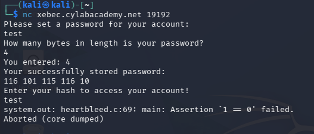
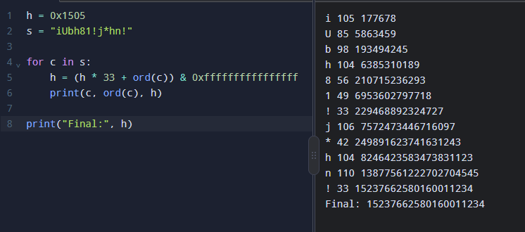

# Heartbleed (Reverse Engineering)

**Flag:** `academy{d0nt_trust_us3rs}`

## 1. First: Run the program

We connected to the challenge:



```
nc xebec.cylabacademy.net 19192
Please set a password for your account:
test
How many bytes in length is your password?
4
You entered: 4
Your successfully stored password:
116 101 115 116 10
Enter your hash to access your account!
test
system.out: heartbleed.c:69: main: Assertion `1 == 0' failed.
Aborted (core dumped)
```

The interesting part is:

```
116 101 115 116 10
```

These are **ASCII values**.

For example:
```
116 = t
101 = e
115 = s
116 = t
10  = newline
```

So:
```
116 101 115 116 10
  ↓   ↓   ↓   ↓   ↓
  t   e   s   t   \n
```

## 2. Look at readable text inside the binary

We used:

```bash
strings -n 4 system.out
```

`strings` searches the binary for sequences of printable characters.

We found:

```
Please set a password for your account:
How many bytes in length is your password?
You entered: %d
Your successfully stored password:
Enter your hash to access your account!
No digits were found
heartbleed.c
1 == 0
flag.txt
Could not open flag.txt
Failed to read the flag
main
obf_bytes
hash
make_secret
```

This is extremely useful. We now know the binary contains functions
named:

```
main
hash
make_secret
```

And something called:

```
obf_bytes
```

The word `obf` is commonly short for obfuscated. So we should
investigate those.

## 3. Find the hash() function

We used:

```bash
objdump -d -M intel system.out | grep -A40 '<hash>:'
```

`objdump` lets us see the program's assembly instructions.

We found:

```
0000000000001309 <hash>:
```

The important instructions were:

```asm
mov QWORD PTR [rbp-0x8],0x1505
```

This tells us that a variable starts with:
```
0x1505
```

Then we saw:

```asm
shl rax,0x5
add rdx,rax
```

`shl` means shift left. Shifting left by 5 is equivalent to multiplying
by:
```
2^5 = 32
```

Then the original value was added too. So:
```
value × 32 + value
```
becomes:
```
value × 33
```

Then:

```asm
add rax,rdx
```

adds the current character/byte.

So the algorithm is basically:
```
hash = hash × 33 + byte
```

The loop continues until it reaches:
```
0x00
```
which is the C null terminator.

## 4. Turn the assembly into C-like code

This is one of the most useful reverse-engineering skills. Instead of
trying to understand every assembly instruction individually, translate
the overall logic.

The assembly we saw becomes approximately:

```c
unsigned long hash(char *str)
{
    unsigned long h = 0x1505;
    while (*str != '\0')
    {
        h = h * 33 + *str;
        str++;
    }
    return h;
}
```

This is much easier to understand.

In simple words: start with `h = 0x1505`. Then for every character,
`h = h × 33 + character`, until the string ends.

## 5. Understand 0x1505

You will see a lot of values beginning with `0x`. That means the number
is written in hexadecimal.

For example:
```
0xAA
```
means decimal:
```
170
```

And `0x1505` is a hexadecimal number used as the initial hash value.

You don't necessarily need to convert every hex number immediately.
When reversing, first ask: *"Is this value being used as data, an
address, a flag, or a constant?"*

## 6. Find make_secret()

Next we looked at:

```bash
objdump -d -M intel system.out | grep -A60 '<make_secret>:'
```

We found:

```
000000000000135e <make_secret>:
```

The interesting part was:

```asm
lea rdx,[rip+0xc89] # 2008 <obf_bytes>
```

This tells us that the function is accessing `obf_bytes` at address
`0x2008`.

Then:

```asm
movzx eax,BYTE PTR [rax]
```

means: read one byte.

Then:

```asm
xor eax,0xffffffaa
```

This tells us the byte is being XORed with `0xAA`.

So we can simplify the important part to:

```c
secret[i] = obf_bytes[i] ^ 0xAA;
```

## 7. What is XOR?

XOR is a very common operation in CTFs. The operator is `^`.

For example:
```
C3 XOR AA
```
In hexadecimal:
```
  C3
  AA
  --
  69
```

So `0xC3 ^ 0xAA = 0x69`, and hexadecimal `0x69` is ASCII `i`.

Very useful property — XOR can also reverse itself:
```
A ^ B = C
then:
C ^ B = A
```

So if the programmer does `secret ^ 0xAA`, we can undo it with
`obfuscated ^ 0xAA`, because `0xAA ^ 0xAA = 0x00`.

## 8. Look at the raw bytes

We used:

```bash
objdump -s -j .rodata system.out
```

This showed:

```
2000 01000200 00000000 c3ffc8c2 929b8bc0
2010 80c2c48b 00000000 506c6561 73652073
```

The important part starts at `0x2008`.

Remember: `2000` is the address at the beginning of the row. Each byte
is two hexadecimal digits. So:

```
2000  01 00 02 00 00 00 00 00
2008  c3 ff c8 c2 92 9b 8b c0
2010  80 c2 c4 8b 00 ...
```

Therefore the obf_bytes are:
```
C3 FF C8 C2 92 9B 8B C0 80 C2 C4 8B 00
```

## 9. Decode the secret

We know:
```
secret = obfuscated byte XOR 0xAA
```

So we do:

```
C3 ^ AA = 69 = i
FF ^ AA = 55 = U
C8 ^ AA = 62 = b
C2 ^ AA = 68 = h
92 ^ AA = 38 = 8
9B ^ AA = 31 = 1
8B ^ AA = 21 = !
C0 ^ AA = 6A = j
80 ^ AA = 2A = *
C2 ^ AA = 68 = h
C4 ^ AA = 6E = n
8B ^ AA = 21 = !
```

Therefore:
```
i U b h 8 1 ! j * h n !
```

The hidden string is:
```
iUbh81!j*hn!
```

## 10. Understand the 00

At the end we have `00`. This is important.

In C, strings normally end with `'\0'`, which is `0x00`. So:

```
C3 FF C8 C2 92 9B 8B C0 80 C2 C4 8B 00
```

means:
```
[12 characters][END]
```

The actual secret is `iUbh81!j*hn!`, and `00` tells the program: *"The
string ends here."*

## 11. Understand what make_secret() does

We can now combine what we learned. The function essentially does:

```c
unsigned long make_secret()
{
    char secret[13];
    for (int i = 0; obf_bytes[i] != '\0'; i++)
    {
        secret[i] = obf_bytes[i] ^ 0xAA;
    }
    secret[12] = '\0';
    return hash(secret);
}
```

Notice something important. It does not return `iUbh81!j*hn!`. It
passes the secret to `hash(secret)` and returns the hash.

So the actual thing we need to submit is not the secret. We need:
```
hash("iUbh81!j*hn!")
```

## 12. Understand the main() function

We then examined:

```bash
objdump -d -M intel system.out | grep -A150 '<main>:'
```

The important sequence was:

```
Read user's input
   ↓
Parse it as a number
   ↓
make_secret()
   ↓
Compare user's number with secret hash
   ↓
If equal → continue
   ↓
Read flag.txt
```

The important assembly was:

```asm
call 135e <make_secret>
```

Then:

```asm
cmp rax,[rbp-0xf8]
```

Then:

```asm
jne 172a
```

In simple terms:
```c
expected_hash = make_secret();
if (user_hash != expected_hash)
{
    // fail
}
```

So the challenge is essentially asking: *"Can you figure out the hash
value that the program expects?"*

## 13. Why did test fail?

We initially entered `test` when the program asked:
```
Enter your hash to access your account!
```

But the program uses `strtoul()` to convert the input into a number. It
expects something like:
```
15237662580160011234
```
not `test`.

Because `test` isn't a valid decimal number, the parsing check fails
and the program eventually reaches:
```
Assertion `1 == 0' failed
```

So that error wasn't the actual vulnerability/solution. It was
basically the program saying: *"That isn't a valid hash number."*

## 14. Calculate the hash

Now we know:
```
secret = iUbh81!j*hn!
```

And the hash algorithm is:
```
h = 0x1505
for every character:
    h = h × 33 + character
```

Remember that characters have ASCII values. For example:
```
i = 105
U = 85
b = 98
h = 104
8 = 56
1 = 49
! = 33
j = 106
* = 42
h = 104
n = 110
! = 33
```

So conceptually:

```
Start: h = 0x1505

'i': h = h × 33 + 105
'U': h = h × 33 + 85
'b': h = h × 33 + 98
...
```

After processing the entire string `iUbh81!j*hn!` we get:
```
15237662580160011234
```

### How to calc it:

Using python to calculate it using:

```python
h = 0x1505
s = "iUbh81!j*hn!"

for c in s:
    h = (h * 33 + ord(c)) & 0xffffffffffffffff
    print(c, ord(c), h)

print("Final:", h)
```



```
i 105 177678
U 85  5863459
b 98  193494245
h 104 6385310189
8 56  210715236293
1 49  6953602797718
! 33  229468892324727
j 106 7572473446716097
* 42  249891623741631243
h 104 8246423583473831123
n 110 13877561222702704545
! 33  15237662580160011234
Final: 15237662580160011234
```

**Why `& 0xffffffffffffffff`?**

This represents keeping only the lower **64 bits**, which matches the
`unsigned long` behavior of our 64-bit Linux binary.

## 15. Submit the hash

So instead of `test`, we enter:

```
15237662580160011234
```

The program calculates its own expected value:
```
15237662580160011234
```

Then compares:
```
User input == Expected hash
```

Therefore the check succeeds. The program then reads `flag.txt` and
gives us:

```
academy{d0nt_trust_us3rs}
```

## 16. The whole challenge in one picture

This is probably the most important thing to remember:

```
system.out
    │
    ↓
Find obf_bytes
    │
    ↓
C3 FF C8 C2 92 9B 8B C0 80 C2 C4 8B 00
    │
    │ XOR 0xAA
    ↓
iUbh81!j*hn!
    │
    ↓
hash()
    │
    │ h = h × 33 + byte
    ↓
15237662580160011234
    │
    ↓
Enter this number
    │
    ↓
Hashes match?
   /      \
  NO      YES
  ↓        ↓
Fail    flag.txt
           │
           ↓
academy{d0nt_trust_us3rs}
```
